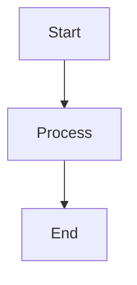

# Mermaid Diagram Renderer

A desktop application built with Electron that allows you to select Mermaid.js files from your computer and render beautiful diagrams.

## Features

- 📁 **File Selection**: Choose files containing Mermaid.js code from your computer
- 🎨 **Live Rendering**: Render Mermaid diagrams with a single click
- 🔄 **Auto-Refresh**: Automatically updates diagrams when files change
- 📱 **Drag & Drop**: Drag files directly onto the application window
- 🔍 **Smart Detection**: Automatically detects Mermaid code in various file formats
- 👁️ **File Watching**: Real-time monitoring of file changes with visual indicators
- 🧹 **Clear Function**: Reset the application to start fresh
- 📊 **Multiple Diagram Types**: Supports all Mermaid diagram types

## Supported File Formats

- `.md` - Markdown files (with ```mermaid code blocks)
- `.txt` - Plain text files
- `.mmd` - Mermaid files
- `.mermaid` - Mermaid files

## Supported Diagram Types

- Flowcharts
- Sequence Diagrams
- Class Diagrams
- State Diagrams
- Entity Relationship Diagrams
- User Journey Diagrams
- Gantt Charts
- Pie Charts
- Git Graphs
- Requirement Diagrams
- Mindmaps
- Timelines

## Installation

1. Clone this repository
2. Install dependencies:
   ```bash
   npm install
   ```

## Usage

1. Start the application:
   ```bash
   npm start
   ```

2. **Select a file**: 
   - Click the "📁 Select File" button to open a file dialog
   - Or drag and drop a file containing Mermaid code onto the application

3. **Auto-refresh**: The diagram will automatically update when you save changes to the file
   - Toggle auto-refresh on/off using the "🔄 Auto-render on file change" checkbox
   - Watch status indicator shows when file monitoring is active

4. **Manual render**: Click the "🎨 Render Diagram" button to manually update

5. **Clear**: Use the "🗑️ Clear" button to reset and start over

## Example Files

The `examples/` folder contains sample Mermaid files you can use to test the application:

- `flowchart.md` - A flowchart showing a debugging process
- `sequence.mmd` - A sequence diagram showing user authentication
- `class-diagram.txt` - A class diagram for an e-commerce system

## File Format Examples

### Markdown with Mermaid Code Block
```markdown
# My Diagram


```

### Plain Mermaid Code
```
flowchart LR
    A[Input] --> B[Process]
    B --> C[Output]
```

## Auto-Refresh Feature

The application includes real-time file monitoring that automatically updates diagrams when you save changes to the source file. This is perfect for:

- **Live editing**: Edit your Mermaid files in any text editor and see changes instantly
- **Iterative design**: Quickly refine diagrams without manual refresh
- **Real-time collaboration**: Share your screen while editing for live demonstrations

### File Watching Indicators

- 🟢 **Green indicator**: File watching is active and monitoring changes
- ⚠️ **Warning**: File watching is inactive or encountered an error
- 💛 **Flash**: File change detected and diagram updated

### Auto-Refresh Controls

- Use the checkbox to enable/disable automatic rendering
- Manual render button remains available when auto-refresh is disabled
- File watching continues even when auto-refresh is off

## Troubleshooting

- **Diagram not rendering**: Ensure your Mermaid syntax is correct
- **File not loading**: Check that the file contains valid Mermaid code
- **Auto-refresh not working**: Try selecting the file again using the "Select File" button
- **File watching error**: Check that the file still exists and is accessible
- **Application won't start**: Make sure all dependencies are installed with `npm install`

## Development

- Built with Electron
- Uses Mermaid.js for diagram rendering
- Node.js integration enabled for file system access

## License

ISC