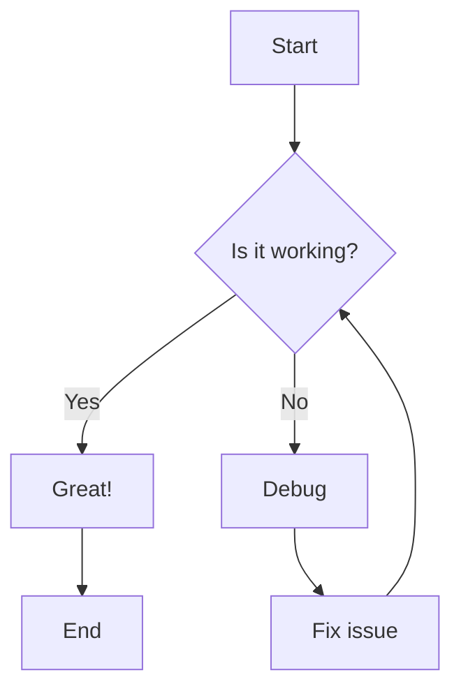

# Sample Flowchart

This is a sample Mermaid flowchart diagram.

```mermaid
flowchart TD
    A[Start] --> B{Is it working?}
    B -->|Yes| C[Great!]
    B -->|No| D[Debug]
    D --> E[Fix issue]
    E --> B
    C --> F[End]
```

This flowchart demonstrates a simple debugging process with decision points and loops.
